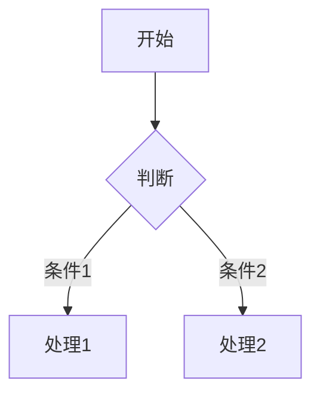

# UserManual 编写指引

本指引规范 `backlog/wiki/usermanual` 目录的文档组织与编写方式。该目录通过 `SUMMARY.md` 定义导航结构，以 Markdown 文件承载内容，最终可渲染为在线用户手册。

---

## 1. 目录结构规范

```
usermanual/
├── README.md              # 封面/简介页（必需）
├── SUMMARY.md             # 目录导航定义（必需）
├── assets/                # 全局公共资源（图片、Logo 等）
│
├── 00-开始使用/           # 章节文件夹：数字前缀 + 章节名
│   ├── 00-产品概述.md
│   ├── 01-隐私政策.md
│   └── ...
│
├── 10-管理后台/           # 数字前缀决定左侧导航排序
│   ├── assets/            # 章节私有资源（可选）
│   ├── 00-用户登录.md
│   ├── 01-看板.md
│   └── ...
│
├── 11-勘察APP/
│   ├── assets/
│   ├── 00-安装.md
│   └── ...
│
└── ...
```

### 1.1 文件夹命名规则

| 规则 | 说明 | 示例 |
|------|------|------|
| `数字前缀-章节名` | 两位或以上数字，用于控制导航顺序；后跟中文章节名 | `00-开始使用`、`10-管理后台` |
| 数字间隔 | 建议按 **10 为步长** 预留，方便后续插入新章节 | `10-`、`20-`、`30-` |
| 纯英文与数字 | 仅当需要国际化或技术章节时使用英文 | `20-API文档` |

### 1.2 文件命名规则

| 规则 | 说明 | 示例 |
|------|------|------|
| `数字前缀-标题.md` | 固定宽度、左侧补零的连续序号，确保字典序即阅读序 | `00-产品概述.md`、`01-隐私政策.md` |
| 宽度选择 | 文件较少的章节用两位（`00`~`99`）；超过 100 篇可用三位（`000`~`999`） | `00-安装.md`、`015-高级配置.md` |
| 空格与连字符 | 数字前缀与标题之间**必须有空格或连字符**；标题内用空格或连字符均可 | `01-隐私政策.md`、`02-项目地图.md` |

---

## 2. SUMMARY.md 编写规范

`SUMMARY.md` 是 **核心导航文件**，直接决定左侧目录树的渲染结果。

### 2.1 基本格式

```markdown
## 开始使用

- [产品概述](00-开始使用/00-产品概述.md)
- [隐私政策](00-开始使用/01-隐私政策.md)

## 管理后台

- [用户登录](10-管理后台/00-用户登录.md)
- [看板](10-管理后台/01-看板.md)

## 任务计划

- [岩土信息化总结](70-任务计划/00-岩土信息化总结.md)
    - [任务记录](70-任务计划/01-任务记录.md)
```

### 2.2 语法规则

| 元素 | 语法 | 说明 |
|------|------|------|
| 分组标题 | `## 分组名` | 对应左侧导航的一个**可折叠分组** |
| 页面链接 | `- [显示标题](相对路径)` | 相对路径从 `SUMMARY.md` 所在目录开始 |
| 多级列表（嵌套） | 子项使用 **4 个空格** 缩进 |  支持多级嵌套导航，但建议不超过 **2 级** |

### 2.3 注意事项

1. **路径必须相对**：使用 `10-管理后台/00-用户登录.md`，而非绝对路径。
2. **标题与文件名可不同**：中括号 `[显示标题]` 是导航树中展示的名称，可与文件名不一致。
3. **顺序即导航顺序**：`SUMMARY.md` 中的书写顺序 = 左侧导航的显示顺序。
4. **README.md 自动为首页**：无需在 `SUMMARY.md` 中显式引用 `README.md` 会自动将其作为书籍首页。
5. **多级列表缩进**：子项必须使用 **4 个空格** 缩进（Tab 或 2 个空格可能无法正确渲染）。示例：
   ```markdown
   - [岩土信息化总结](70-任务计划/00-岩土信息化总结.md)
       - [任务记录](70-任务计划/01-任务记录.md)
   ```

---

## 3. 页面内容（Markdown）编写规范

### 3.1 标题层级

| 层级 | 用途 | 示例 |
|------|------|------|
| `#` 一级标题 | **页面主标题**，每页**有且仅有 1 个** | `# 用户登录` |
| `##` 二级标题 | 页面内大模块划分 | `## 安装` |
| `###` 三级标题 | 功能点或子模块 | `### 工作任务` |
| `####` 四级标题 | 具体操作步骤 | `#### 项目详情` |
| `#####` 五级标题 | 更细粒度的步骤或说明 | `##### 勘探孔表` |

> **去序号原则**：所有 Markdown 标题中均**不得出现章节序号前缀**（如 `1.1`、`2.4.1`、`A7`、`B1` 等）。序号由文件名的数字前缀统一控制，标题本身保持纯文本。 | | |

> **重要**：一级标题 `#` 必须放在页面最顶部，且只出现一次，会将其作为该页面的默认标题。

### 3.2 正文风格

- **段落间空一行**：Markdown 段落之间保留一个空行，提高可读性。
- **步骤说明**：操作类文档使用“点击… → 进入… → 输入…”的叙事方式。
- **截图标注**：每张截图下方单独一行用 `截图说明` 标注，便于理解上下文。

```markdown
打开浏览器，在地址栏输入 <https://geoapp.gzpi.com.cn/>，将进入后台管理系统。


>后台管理系统登录页的截图说明
```

---

## 4. 图片与资源引用规范

### 4.1 资源存放策略

采用 **"就近原则 + 全局兜底"**：

| 资源类型 | 存放位置 | 引用路径 | 适用场景 |
|----------|----------|----------|----------|
| 全局通用 | `usermanual/assets/` | `../assets/xxx.png` | Logo、首页大图、跨章节复用图 |
| 章节私有 | `章节文件夹/assets/` | `assets/xxx.png` | 仅该章节使用的截图 |
| 章节私有（媒体） | `章节文件夹/media/` | `media/xxx.png` | 视频、PPT 转换图、大批量 SVG |

### 4.2 引用语法

```markdown
<!-- 全局资源（从章节文件出发，向上退一级） -->


<!-- 章节私有资源（与 md 文件同级或下级） -->


<!-- 多个图片并列 -->


<!-- 带说明文字的图片组 -->
> 【校正前】 【校正后】
```

### 4.3 命名建议

- **时间戳命名**：截图可使用 `YYYY-MM-DD-HH-mm-ss.png` 或哈希命名，避免中文文件名导致的编码问题。
- **语义化命名**：若图片有明确含义，可用英文或拼音，如 `login-page.png`、`tilt-correction-before.png`。
- **避免空格**：文件名中尽量不要出现空格，使用 `-` 或 `_` 代替。

---

## 5. 扩展语法

### 5.1 Mermaid 图表

支持流程图、时序图、甘特图、ER 图等：

````markdown

````

### 5.2 Chart / Graph 插件

用于渲染数据图表或函数图像：

```markdown

{
    "data": {
        "type": "bar",
        "columns": [
            ["data1", 30, 200, 100],
            ["data2", 50, 20, 10]
        ]
    }
}



{
    "title": "1/x * cos(1/x)",
    "grid": true,
    "data": [{"fn": "1/x * cos(1/x)"}]
}

```

### 5.3 原始 HTML（视频等）

如需嵌入原生 HTML（如 `<video>` 标签），需用 ` ... ` 包裹，防止解析冲突：

```markdown

<video controls width="100%">
  <source src="https://example.com/video.mp4" type="video/mp4">
</video>

```

---

## 6. 新增章节的完整流程

以新增 **"试验室APP"** 章节为例：

### Step 1：创建章节文件夹

```
usermanual/
└── 13-试验室APP/          # 按排序取未使用的数字前缀
    └── assets/            # 预留资源文件夹
```

### Step 2：编写 Markdown 页面

```markdown
<!-- 13-试验室APP/00-收样.md -->
# 收样

## 扫描样品二维码

打开土工试验APP，点击首页「收样」按钮，使用摄像头扫描样品包装上的二维码。


【收样扫描界面】

扫描成功后，页面将自动跳转至样品信息确认页……
```

### Step 3：更新 SUMMARY.md

在 `SUMMARY.md` 的合适位置插入分组和链接：

```markdown
## 勘察APP

- [安装](11-勘察APP/00-安装.md)
- ...

## 试验室APP

- [收样](13-试验室APP/00-收样.md)
- [试验录入](13-试验室APP/01-试验录入.md)

## API文档

- ...
```

### Step 4：提交与检查

1. 检查左侧导航是否正常显示新增章节。
2. 检查图片是否正常加载（无 404）。

---

## 7. 常见问题（FAQ）

**Q1：SUMMARY.md 中是否可以嵌套多级目录？**
> 支持有限层级，建议保持 **两级结构**：`## 分组` → `- [页面]`。如需更深层级，可在 Markdown 正文中使用标题层级体现，或通过多个分组拆分。

**Q2：文件名或文件夹名可以修改吗？**
> 可以，但修改后必须同步更新 `SUMMARY.md` 中的引用路径，否则会导致导航 404。

**Q3：如何在页面间做交叉引用（内部链接）？**
> 直接使用相对路径链接即可：
> ```markdown
> 详见 [勘探孔操作说明](../11-勘察APP/02-勘察.md)
> ```

---

## 8.  checklist（发布前自检）

- [ ] 新增/修改的页面已同步更新 `SUMMARY.md`
- [ ] 所有图片路径正确，无 404
- [ ] 每页有且仅有 **1 个一级标题 `#`**
- [ ] 无 `[空链接]()` 等无效导航占位符
- [ ] 代码块标注了正确的语言类型（如 ` ```json `、` ```java `）
- [ ] 敏感信息（密码、密钥、内部 IP）已脱敏或删除

---

> **提示**：本文档本身也遵循上述规范编写。在维护用户手册时，建议保持风格一致，便于团队协作与长期维护。
